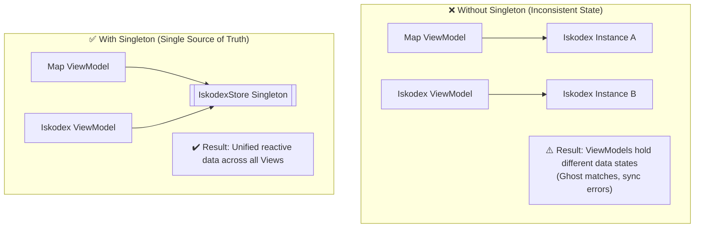
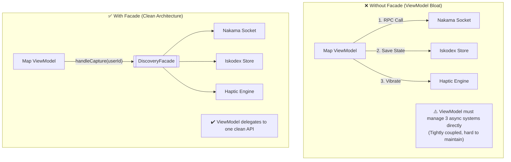
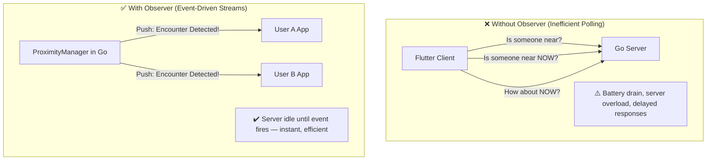
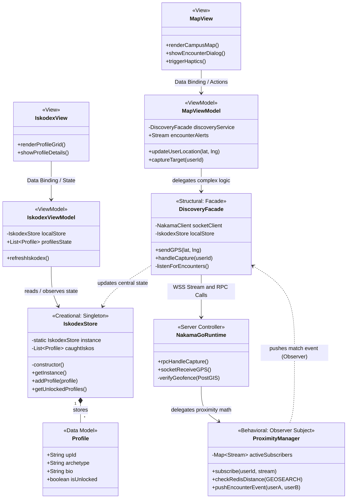

# 💘 IskoLuv — UPV Dating App with a Twist

> *"Di ka makahanap ng organic encounter sa bahay. Edi MagLakad ka."*

---

## 📋 App Summary

**IskoLuv** is a proximity-based dating and social discovery application designed exclusively for the **University of the Philippines Visayas (UPV) Miagao** campus community.

### The Twist: *Catch 'Em All* — Encounter Mechanic 🗺️

Unlike traditional dating apps where users can swipe through profiles from anywhere, **IskoLuv locks profiles behind physical presence**. A user's profile only becomes discoverable when two users are **within a 10-meter radius** of each other, or when a user visits designated **campus landmarks** (e.g., the Oblation, CAS, CUB).

This transforms the dating experience into a **real-world campus scavenger hunt** — encouraging genuine in-person encounters and rewarding students who actively explore UPV Miagao.

### Technical Overview

| Layer | Technology |
|---|---|
| Frontend | Flutter (MVVM Architecture) |
| Backend | Go Runtime on Nakama (Game Server) |
| Hot Spatial Data | Redis (GEOSEARCH) |
| Persistent Storage | PostGIS |
| Real-time Comms | WebSockets (WSS) |

The backend treats the app like a **real-time multiplayer game**, using Redis for zero-latency proximity detection and PostGIS for permanent geospatial records.

---

## 🏗️ Design Pattern Implementation

### 1. Creational Pattern — Singleton

#### i. Name of Pattern
**Creational — Singleton**

---

#### ii. Concept in Conyo 🗣️

Okay so like imagine that you have like an eco bag for all your freebies sa org fair—lahat ng nahuli mong Isko/Iska, dito mo lang nilalagay, hindi pwede madaming bag. The Singleton pattern is what implies na you have like only one eco bag na ginagawa kahit saan mo i-access sa app. Parang sa org, isa lang talaga ang *class president* — lahat nag-aask sa kanya, and you don't like appoint one "class president" per student na naga-ask sa kanya diba??

In IskoLuv, ang **IskodexStore** is like the central state repository of all "nahuli" na profiles. We use the Singleton para ma make sure na **isa lang** ang instance ng store na to sa buong lifecycle ng Flutter app. Basta man nasa Map ka, sa Matches tab, o may nare-receive kang notif — hindi ka nagdadala ng bagong bag every time, palagi kang nag-a-access sa **exact same object** sa memory.

**Applied to:** The **IskodexStore** — the in-app Pokédex-style list ng everyone you've encountered sa campus.

---

#### iii. Visual Diagram



---

#### iv. Why It Works Nga 💡

**Without Singleton:** Every ViewModel you have to like gawa your own version ng match list. Kapag you encounter one person na malapit sa Library, yung data na yun hindi agad makikita sa "Matches" tab — kasi they are looking at magkaibang objects na. Just like your crush na hindi ka gusto, ghost data ang kinalabasan plus sobrang sayang ng memory dahil maraming redundant na objects.

**With Singleton:** Isa lang ang *source of truth*. Kahit anong screen ang buksan mo, only one lang ang IskodexStore that they consult. Data integrity guaranteed, memory efficient, and walang sync issues — na-catch mo ang isang tao malapit sa Oblation, visible agad siya sa lahat ng views. So like time to stalk your crush guyssss.

---

#### v. Pseudocode

```dart
// Dart (Flutter)

class IskodexStore {
  // Static private instance — created once, ever
  static final IskodexStore _instance = IskodexStore._internal();

  List<Profile> discoveredIskos = [];

  // Factory constructor — always returns the same instance
  factory IskodexStore() {
    return _instance;
  }

  // Private constructor — prevents external instantiation
  IskodexStore._internal();

  void addProfile(Profile profile) {
    discoveredIskos.add(profile);
    notifyListeners(); // Reactively updates all bound ViewModels
  }

  List<Profile> getUnlockedProfiles() {
    return discoveredIskos.where((p) => p.isUnlocked).toList();
  }
}

// Usage anywhere in the app — always the same object:
// final store = IskodexStore();
```

---

### 2. Structural Pattern — Facade

#### i. Name of Pattern
**Structural — Facade**

---

#### ii. Concept in Conyo 🗣️

Imagine mo that you order sa canteen — hindi mo kailangan magluto, mag-wash ng pinggan, at mag-set ng table (I ain't doing all that, duhhh we a helper kaya). May isang *ate sa counter* lang ang kinakausap mo, and she like handles all those task at the back. Yun ang Facade — isa lang ang *entry point*, kahit maraming klase ng work that happens sa loob.

Sa IskoLuv, kapag may na-encounter kang user, maraming nangyayari sabay-sabay: nag-i-issue ng RPC call sa Go backend, nag-u-update ng local IskodexStore, at nag-ti-trigger ng haptic feedback. Ang **DiscoveryFacade** ang nag-a-abstract ng lahat ng ito. Ang MapViewModel — isang method lang ang tatawagin: `handleCapture()`. Isang tawag lang, tapos na lahat ng hanash mo—no need to chika with every kitchen staff.

**Applied to:** The **encounter/capture flow** — when a user is detected within 10 meters and a match is initiated.

---

#### iii. Visual Diagram



---

#### iv. Why It Works Nga 💡

**Without Facade:** Ang MapViewModel will have like a lot of responsibilities unlike me na super chill lang — mag-wwait siya ng RPC, mag-s-save sa local store, mag-vi-vibrate ang phone — lahat sa loob ng isang ViewModel. Pag nagchange na ang logic ng Nakama communication o ng haptic engine, you have to like find at i-update ang *bawat* ViewModel na nag-ha-handle ng encounters. Maintenance nightmare.

**With Facade:** Loyal si ViewModel, isa lang talaga kausap niya—hindi siya two-timer, promise! Its only talking to DiscoveryFacade. Doon na naka-encapsulate ang lahat ng complexity. Pag nagbago ang backend communication logic, doon mo lang i-u-update — hindi mo na kailangang hawakan ang presentation layer. Clean, decoupled, and MVVM-compliant.

---

#### v. Pseudocode

```dart
// Dart (Flutter)

// Complex Subsystems (hidden from ViewModel)
class NakamaClient {
  void rpcCapture(String userId) { /* WSS RPC to Go backend */ }
}

class HapticEngine {
  void triggerVibrate() { /* Device haptic feedback */ }
}

// The Facade — single API for the encounter flow
class DiscoveryFacade {
  final NakamaClient _socket = NakamaClient();
  final IskodexStore _localStore = IskodexStore(); // Reuses Singleton
  final HapticEngine _fx = HapticEngine();

  void handleCapture(Profile targetUser) {
    _localStore.addProfile(targetUser);   // 1. Save locally
    _fx.triggerVibrate();                 // 2. Haptic feedback
    _socket.rpcCapture(targetUser.upId); // 3. Notify backend
    print("Successfully captured: ${targetUser.archetype}");
  }
}

// MapViewModel usage (all it needs to know):
// discoveryFacade.handleCapture(detectedUser);
```

---

### 3. Behavioral Pattern — Observer

#### i. Name of Pattern
**Behavioral — Observer**

---

#### ii. Concept in Conyo 🗣️

Para lang siya sa *group chat notification*. You don't open a GC every second para like makita kung may Chill ka lang, tapos pag may importanteng announcement, ping agad sa'yo. Yun ang Observer — ang Subject ang nag-ma-manage ng listahan ng mga nakikinig (Observers), at sila lang binibigyan ng update kapag may nangyari.

Sa IskoLuv, ang **ProximityManager** sa Go backend ang Subject. All of the users connected via WebSocket ay mga Observers. Instead of puro polling ng Flutter app ("meron na ba? meron na? paano ngayon?"), ang Go server ang mag-pu-push ng encounter event only when two users cross the 10-meter threshold in Redis.

**Applied to:** The **real-time proximity detection system** — backend push notifications when two users enter each other's range.

---

#### iii. Visual Diagram



---

#### iv. Why It Works Nga 💡

**Without Observer:** Kung mag-po-poll ang Flutter app sa server every second (napaka obnoxious naman) — grabe talaga ang battery drain, nauubos ang mobile data, at nag-o-overload ang server ng walang kwentang requests. Even if there is no encounter, laging may traffic. Hindi sustainable, especially sa isang location-based app na gustong laging bukas ng users.

**With Observer:** Naka-subscribe ang bawat user sa ProximityManager. Tahimik lang, parang sa library—walang ingay hangga’t walang chismis (encounter). Pag may dalawang users na nag-cross ng 10-meter threshold sa Redis GEOSEARCH — only *then* mag-pu-push ang server. Instant, game-like ang feel, at minimal ang network traffic. Reactive architecture at its finest. Parang org life—react ka lang pag may event, hindi ka naman laging on the go.

---

#### v. Pseudocode

```go
// Go (Nakama Runtime)

type Stream interface {
    Send(message string)
}

type LocationData struct {
    ID  string
    Lat float64
    Lng float64
}

type ProximityManager struct {
    ActiveSubscribers map[string]Stream
}

// Users register themselves when they open the app
func (pm *ProximityManager) Subscribe(userID string, stream Stream) {
    pm.ActiveSubscribers[userID] = stream
}

// Unsubscribe on app close
func (pm *ProximityManager) Unsubscribe(userID string) {
    delete(pm.ActiveSubscribers, userID)
}

// Called by Redis GEOSEARCH result handler
func (pm *ProximityManager) CheckRedisDistance(userA, userB LocationData) {
    if calculateDistance(userA, userB) <= 10.0 { // meters
        pm.PushEncounterEvent(userA.ID, userB.ID)
    }
}

// Notify both users — they are Observers
func (pm *ProximityManager) PushEncounterEvent(idA string, idB string) {
    pm.ActiveSubscribers[idA].Send("New Isko/Iska nearby! Check your map!")
    pm.ActiveSubscribers[idB].Send("New Isko/Iska nearby! Check your map!")
}
```

---

## 🗺️ Complete Logical View

The following class diagram illustrates the full integration of the **MVVM frontend architecture** with all three design patterns and the Go backend.



---

## 👥 Group Members
Aspera, Eryl Joseph
Del Rosario, Nina Claudia
Hernia, Christian Joseph
Oyco, Cedric
Tolentino, EJ
---

*CMSC 129 Software Engineering II — Activity #2: System Architecture*
*University of the Philippines Visayas, 2nd Semester AY 2025-2026*
